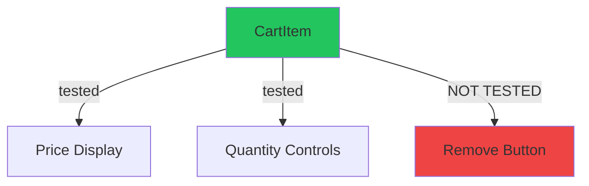

# Test Documentation Generator

Generate visual test coverage documentation with gap analysis.

## Overview

This command creates an interactive HTML dashboard showing:
- Test coverage heatmaps
- Gap analysis with priority matrix
- Component diagrams with test overlays
- Architecture diagrams
- Screenshots with tested element hotspots

## Usage

```bash
/document-tests [JIRA-PROJECT | JIRA-TICKET | FEATURE-NAME | COMPONENT-NAME | DIRECTORY]
```

## Examples

```bash
/document-tests REW               # Analyze entire team/squad (all REW tickets)
/document-tests EPS-1234          # Analyze ticket-related code
/document-tests shopping-cart     # Analyze feature
/document-tests CartItem.tsx      # Analyze component
/document-tests src/features/checkout  # Analyze directory
```

---

## Implementation Steps

### Step 1: Prerequisites Check

```bash
echo "━━━━━━━━━━━━━━━━━━━━━━━━━━━━━━━━━━━━━━━━"
echo "📋 Test Documentation Generator"
echo "━━━━━━━━━━━━━━━━━━━━━━━━━━━━━━━━━━━━━━━━"
echo ""

# Check for required tools
MISSING_TOOLS=()

if ! command -v git &> /dev/null; then
  MISSING_TOOLS+=("git")
fi

if ! command -v node &> /dev/null; then
  MISSING_TOOLS+=("node")
fi

if [ ${#MISSING_TOOLS[@]} -gt 0 ]; then
  echo "❌ Missing required tools:"
  printf '   - %s\n' "${MISSING_TOOLS[@]}"
  exit 1
fi

echo "✅ All prerequisites met"
echo ""
```

### Step 2: Get Input Scope

Use the `AskQuestion` tool to ask the user:

**Question 1: Input Type**
- id: `input_type`
- prompt: "What would you like to document?"
- options:
  - `jira_project` - "JIRA Project (Team/Squad coverage - all tickets)"
  - `jira_ticket` - "JIRA Ticket (analyzes PR/linked files)"
  - `feature` - "Feature Name (searches feature folders)"
  - `component` - "Component Name (specific file)"
  - `directory` - "Directory Path (analyzes folder)"
- allow_multiple: false

**Question 2: Input Value**
Based on the answer, ask for the specific value as a follow-up text input.

### Step 3: Smart Discovery

```bash
echo "🔍 Discovering test scope..."
echo ""

INPUT_TYPE="{{input_type}}"  # From AskQuestion
INPUT_VALUE="{{input_value}}"  # User's input

SCOPE_FILES=()
SCOPE_TESTS=()
SCOPE_NAME=""

case "$INPUT_TYPE" in
  "jira_project")
    echo "🏢 Analyzing JIRA Project/Squad: $INPUT_VALUE"
    echo ""
    
    # Check if JIRA CLI is authenticated
    if ! jira version &> /dev/null; then
      echo "❌ JIRA CLI not authenticated"
      echo "Run: jira init"
      exit 1
    fi
    
    echo "📊 Fetching all tickets in project: $INPUT_VALUE..."
    echo "⏳ This may take a while for large projects..."
    echo ""
    
    # Get all tickets from the project (Done, In Progress, etc.)
    # Exclude: Cancelled, Rejected
    JIRA_TICKETS=$(jira issue list --project "$INPUT_VALUE" --status "!Cancelled,!Rejected" --plain --columns KEY --no-headers 2>/dev/null | awk '{print $1}')
    
    if [ -z "$JIRA_TICKETS" ]; then
      echo "❌ No tickets found in project: $INPUT_VALUE"
      echo "   Make sure the project key is correct (e.g., REW, EPS, CONV)"
      exit 1
    fi
    
    TICKET_COUNT=$(echo "$JIRA_TICKETS" | wc -l | tr -d ' ')
    echo "✅ Found $TICKET_COUNT tickets in $INPUT_VALUE"
    echo ""
    
    # Collect all unique files from all tickets
    ALL_FILES=()
    TICKETS_WITH_FILES=0
    
    echo "🔍 Analyzing tickets and finding related code..."
    
    # Process tickets in batches to show progress
    COUNTER=0
    while IFS= read -r TICKET; do
      COUNTER=$((COUNTER + 1))
      
      # Show progress every 10 tickets
      if [ $((COUNTER % 10)) -eq 0 ]; then
        echo "   Processed $COUNTER/$TICKET_COUNT tickets..."
      fi
      
      # Try to get PR from ticket
      PR_URL=$(jira issue view "$TICKET" --plain 2>/dev/null | grep -oE 'https://github.com/[^/]+/[^/]+/pull/[0-9]+' | head -1)
      
      if [ -n "$PR_URL" ]; then
        PR_NUMBER=$(echo "$PR_URL" | grep -oE '[0-9]+$')
        
        # Get changed files from PR
        PR_FILES=$(gh pr view "$PR_NUMBER" --json files --jq '.files[].path' 2>/dev/null | grep -E '\.(ts|tsx|js|jsx)$' | grep -v -E '\.(spec|test)\.')
        
        if [ -n "$PR_FILES" ]; then
          TICKETS_WITH_FILES=$((TICKETS_WITH_FILES + 1))
          while IFS= read -r file; do
            if [ -f "$file" ]; then
              ALL_FILES+=("$file")
            fi
          done <<< "$PR_FILES"
        fi
      else
        # Fallback: search git history for ticket mentions
        COMMIT_FILES=$(git log --all --grep="$TICKET" --name-only --pretty=format: 2>/dev/null | sort -u | grep -E '\.(ts|tsx|js|jsx)$' | grep -v -E '\.(spec|test)\.')
        
        if [ -n "$COMMIT_FILES" ]; then
          TICKETS_WITH_FILES=$((TICKETS_WITH_FILES + 1))
          while IFS= read -r file; do
            if [ -f "$file" ]; then
              ALL_FILES+=("$file")
            fi
          done <<< "$COMMIT_FILES"
        fi
      fi
    done <<< "$JIRA_TICKETS"
    
    # Remove duplicates
    SCOPE_FILES=($(printf '%s\n' "${ALL_FILES[@]}" | sort -u))
    
    echo ""
    echo "━━━━━━━━━━━━━━━━━━━━━━━━━━━━━━━━━━━━━━━━"
    echo "📊 Project Analysis Summary"
    echo "━━━━━━━━━━━━━━━━━━━━━━━━━━━━━━━━━━━━━━━━"
    echo ""
    echo "Project:           $INPUT_VALUE"
    echo "Total Tickets:     $TICKET_COUNT"
    echo "Tickets with PRs:  $TICKETS_WITH_FILES"
    echo "Unique Files:      ${#SCOPE_FILES[@]}"
    echo ""
    
    if [ ${#SCOPE_FILES[@]} -eq 0 ]; then
      echo "❌ No source files found for project $INPUT_VALUE"
      echo "   This could mean:"
      echo "   - Tickets don't have PRs linked"
      echo "   - PRs are in a different repo"
      echo "   - No commits mention the ticket IDs"
      exit 1
    fi
    
    SCOPE_NAME="$INPUT_VALUE-Team"
    ;;
    
  "jira_ticket")
    echo "📋 Analyzing JIRA ticket: $INPUT_VALUE"
    
    # Check if JIRA CLI is authenticated
    if ! jira issue view "$INPUT_VALUE" &> /dev/null; then
      echo "❌ JIRA CLI not authenticated or ticket not found"
      echo "Run: jira init"
      exit 1
    fi
    
    # Get PR from ticket
    PR_URL=$(jira issue view "$INPUT_VALUE" --plain | grep -oE 'https://github.com/[^/]+/[^/]+/pull/[0-9]+' | head -1)
    
    if [ -n "$PR_URL" ]; then
      PR_NUMBER=$(echo "$PR_URL" | grep -oE '[0-9]+$')
      echo "✅ Found PR: #$PR_NUMBER"
      
      # Get changed files from PR
      SCOPE_FILES=($(gh pr view "$PR_NUMBER" --json files --jq '.files[].path' 2>/dev/null))
    else
      echo "⚠️  No PR found, searching for ticket mentions in recent commits..."
      SCOPE_FILES=($(git log --all --grep="$INPUT_VALUE" --name-only --pretty=format: | sort -u | grep -E '\.(ts|tsx|js|jsx)$'))
    fi
    
    SCOPE_NAME="$INPUT_VALUE"
    ;;
    
  "feature")
    echo "🎯 Analyzing feature: $INPUT_VALUE"
    
    # Search for feature folders
    FEATURE_DIRS=$(find . -type d \( -name "node_modules" -o -name ".git" \) -prune -o -type d -iname "*$INPUT_VALUE*" -print 2>/dev/null | grep -E '(features|feature)' | head -5)
    
    if [ -z "$FEATURE_DIRS" ]; then
      echo "❌ No feature folders found matching: $INPUT_VALUE"
      exit 1
    fi
    
    echo "✅ Found feature folders:"
    echo "$FEATURE_DIRS"
    echo ""
    
    # Get all source files in feature folders
    while IFS= read -r dir; do
      FILES=$(find "$dir" -type f \( -name "*.ts" -o -name "*.tsx" -o -name "*.js" -o -name "*.jsx" \) ! -name "*.spec.*" ! -name "*.test.*" 2>/dev/null)
      SCOPE_FILES+=($FILES)
    done <<< "$FEATURE_DIRS"
    
    SCOPE_NAME="$INPUT_VALUE"
    ;;
    
  "component")
    echo "🧩 Analyzing component: $INPUT_VALUE"
    
    # Find the component file
    COMPONENT_FILE=$(find . -type f \( -name "node_modules" -o -name ".git" \) -prune -o -type f -name "$INPUT_VALUE" -print 2>/dev/null | head -1)
    
    if [ -z "$COMPONENT_FILE" ]; then
      echo "❌ Component not found: $INPUT_VALUE"
      exit 1
    fi
    
    echo "✅ Found component: $COMPONENT_FILE"
    SCOPE_FILES=("$COMPONENT_FILE")
    SCOPE_NAME=$(basename "$INPUT_VALUE" | sed 's/\.[^.]*$//')
    ;;
    
  "directory")
    echo "📁 Analyzing directory: $INPUT_VALUE"
    
    if [ ! -d "$INPUT_VALUE" ]; then
      echo "❌ Directory not found: $INPUT_VALUE"
      exit 1
    fi
    
    # Get all source files in directory
    SCOPE_FILES=($(find "$INPUT_VALUE" -type f \( -name "*.ts" -o -name "*.tsx" -o -name "*.js" -o -name "*.jsx" \) ! -name "*.spec.*" ! -name "*.test.*" 2>/dev/null))
    
    echo "✅ Found $(echo ${#SCOPE_FILES[@]}) files"
    SCOPE_NAME=$(basename "$INPUT_VALUE")
    ;;
esac

echo ""
echo "━━━━━━━━━━━━━━━━━━━━━━━━━━━━━━━━━━━━━━━━"
echo "📊 Scope Summary"
echo "━━━━━━━━━━━━━━━━━━━━━━━━━━━━━━━━━━━━━━━━"
echo ""
echo "Name: $SCOPE_NAME"
echo "Files to analyze: ${#SCOPE_FILES[@]}"
echo ""

# Find corresponding test files
for file in "${SCOPE_FILES[@]}"; do
  # Try different test file patterns
  DIR=$(dirname "$file")
  BASE=$(basename "$file" | sed 's/\.[^.]*$//')
  EXT="${file##*.}"
  
  # Pattern 1: Colocated .spec.{ext}
  TEST_FILE="$DIR/$BASE.spec.$EXT"
  if [ -f "$TEST_FILE" ]; then
    SCOPE_TESTS+=("$TEST_FILE")
    continue
  fi
  
  # Pattern 2: Colocated .test.{ext}
  TEST_FILE="$DIR/$BASE.test.$EXT"
  if [ -f "$TEST_FILE" ]; then
    SCOPE_TESTS+=("$TEST_FILE")
    continue
  fi
  
  # Pattern 3: __tests__ folder
  TEST_FILE="$DIR/__tests__/$BASE.spec.$EXT"
  if [ -f "$TEST_FILE" ]; then
    SCOPE_TESTS+=("$TEST_FILE")
    continue
  fi
  
  TEST_FILE="$DIR/__tests__/$BASE.test.$EXT"
  if [ -f "$TEST_FILE" ]; then
    SCOPE_TESTS+=("$TEST_FILE")
    continue
  fi
  
  # Pattern 4: tests/ directory
  RELATIVE_PATH=$(echo "$file" | sed 's|^\./||' | sed 's|^src/||' | sed 's|^app/||')
  TEST_FILE="tests/$RELATIVE_PATH"
  TEST_FILE="${TEST_FILE%.*}.spec.$EXT"
  if [ -f "$TEST_FILE" ]; then
    SCOPE_TESTS+=("$TEST_FILE")
    continue
  fi
  
  TEST_FILE="${TEST_FILE%.*}.test.$EXT"
  if [ -f "$TEST_FILE" ]; then
    SCOPE_TESTS+=("$TEST_FILE")
  fi
done

echo "Test files found: ${#SCOPE_TESTS[@]}"
echo ""
```

### Step 4: Analyze Test Coverage (Test Pyramid)

**⚠️ IMPORTANT:** Use the AI to analyze the files and generate a detailed coverage report.

For each source file, analyze:

1. **Component Type** (classify based on Test Pyramid):
   - UI Components (React components, views)
   - Business Logic (services, utils, hooks)
   - API/Data Layer (API clients, transformers)
   - Integration (feature-level flows)
   - E2E (user journeys)

2. **Test Coverage Analysis**:
   - Does test file exist?
   - What is tested:
     - Props/inputs
     - Rendering/UI states
     - User interactions (clicks, typing)
     - State changes
     - Loading states
     - Error states
     - Edge cases
     - Accessibility
   - What is NOT tested (gaps)
   - Test quality score (0-100)

3. **Risk Assessment**:
   - Critical (payment, auth, data loss)
   - High (core features, complex logic)
   - Medium (UI states, error handling)
   - Low (cosmetic, rarely used)

4. **Code Coverage** (if available):
   - Run Jest/Vitest with coverage: `npm test -- --coverage --collectCoverageFrom='${SCOPE_FILES[@]}'`
   - Extract line/branch coverage %

Generate a JSON structure:

```json
{
  "scope_name": "shopping-cart",
  "scope_type": "jira_project|jira_ticket|feature|component|directory",
  "generated_at": "2026-03-24T10:30:00Z",
  "jira_metadata": {
    "project_key": "REW",
    "total_tickets": 145,
    "tickets_analyzed": 98,
    "tickets_with_prs": 87,
    "sprint": "Sprint 24"
  },
  "summary": {
    "total_files": 15,
    "files_with_tests": 12,
    "files_without_tests": 3,
    "overall_coverage": 85.5,
    "test_pyramid": {
      "e2e": { "count": 2, "coverage": 100 },
      "integration": { "count": 5, "coverage": 80 },
      "unit": { "count": 25, "coverage": 90 }
    },
    "team_metrics": {
      "critical_gaps": 3,
      "high_risk_untested": 8,
      "quality_score": 78.5
    }
  },
  "components": [
    {
      "file": "src/components/CartItem.tsx",
      "type": "UI Component",
      "has_test": true,
      "test_file": "src/components/CartItem.spec.tsx",
      "coverage": {
        "lines": 92.5,
        "branches": 85.0,
        "functions": 100.0
      },
      "tested": [
        "Renders item name and price",
        "Handles quantity change",
        "Handles remove button click",
        "Shows loading state during update"
      ],
      "gaps": [
        "Does not test max quantity validation",
        "Missing error state tests",
        "No accessibility tests"
      ],
      "risk": "Medium",
      "quality_score": 75
    }
  ],
  "gaps": [
    {
      "file": "src/utils/priceCalculator.ts",
      "type": "Business Logic",
      "risk": "Critical",
      "reason": "Handles payment calculations - no tests found"
    }
  ]
}
```

Save this to `.test-docs/data/${SCOPE_NAME}.json`

### Step 5: Generate HTML Dashboard

Create `.test-docs/index.html` (central hub) and `.test-docs/${SCOPE_NAME}.html` (feature page).

Use the AI to generate:

1. **Interactive HTML with:**
   - **Team Overview Section** (for jira_project type):
     - Squad/team name and logo
     - Total tickets analyzed
     - Team quality score
     - Coverage trend chart
   - Coverage heatmap (colored blocks)
   - Filterable component list
   - Gap priority matrix
   - Test pyramid visualization
   - Component detail cards
   - Search functionality
   - **Feature breakdown** by module/area

2. **Embedded visualizations:**
   - Chart.js or D3.js for graphs
   - Mermaid for diagrams
   - Color-coded coverage indicators

3. **Responsive design** (works on mobile)

Template structure:

```html
<!DOCTYPE html>
<html lang="en">
<head>
  <meta charset="UTF-8">
  <meta name="viewport" content="width=device-width, initial-scale=1.0">
  <title>Test Coverage: ${SCOPE_NAME}</title>
  <style>
    /* Modern, clean design with coverage colors */
    :root {
      --coverage-high: #22c55e;    /* >80% - green */
      --coverage-medium: #f59e0b;  /* 50-80% - yellow */
      --coverage-low: #ef4444;     /* <50% - red */
      --coverage-none: #6b7280;    /* 0% - gray */
    }
    /* ... full CSS ... */
  </style>
</head>
<body>
  <header>
    <h1>🧪 Test Coverage: ${SCOPE_NAME}</h1>
    
    <!-- For JIRA Project: Show team metadata -->
    {{#if jira_metadata}}
    <div class="team-info">
      <span class="badge">Squad: ${jira_metadata.project_key}</span>
      <span class="badge">Tickets: ${jira_metadata.total_tickets}</span>
      <span class="badge">PRs Analyzed: ${jira_metadata.tickets_with_prs}</span>
    </div>
    {{/if}}
    
    <div class="summary-cards">
      <div class="card">
        <div class="value">${overall_coverage}%</div>
        <div class="label">Overall Coverage</div>
      </div>
      <div class="card">
        <div class="value">${files_with_tests}/${total_files}</div>
        <div class="label">Files with Tests</div>
      </div>
      <div class="card">
        <div class="value">${critical_gaps}</div>
        <div class="label">Critical Gaps</div>
      </div>
      <div class="card">
        <div class="value">${quality_score}%</div>
        <div class="label">Quality Score</div>
      </div>
    </div>
  </header>
  
  <section class="test-pyramid">
    <!-- SVG or Canvas visualization -->
  </section>
  
  <section class="coverage-heatmap">
    <!-- Color-coded component grid -->
  </section>
  
  <section class="gaps-priority">
    <!-- Risk matrix -->
  </section>
  
  <section class="components-detail">
    <!-- Filterable, searchable list -->
  </section>
  
  <script>
    // Load data from JSON
    // Render interactive charts
    // Handle filtering/search
  </script>
</body>
</html>
```

### Step 6: Generate Component Diagrams

For each component, generate a Mermaid diagram showing:
- Component structure
- Props/state
- Child components
- Test coverage overlay



Convert Mermaid to SVG and embed in HTML.

### Step 7: Generate Screenshots (Optional)

If Playwright is installed, capture component screenshots:

```bash
# Generate screenshot script
cat > .test-docs/scripts/capture-screenshots.js << 'EOF'
const { chromium } = require('playwright');

async function captureComponent(componentPath) {
  const browser = await chromium.launch();
  const page = await browser.newPage();
  
  // Load Storybook or dev server
  await page.goto('http://localhost:3000/component-preview');
  
  // Take screenshot with hotspots
  await page.screenshot({
    path: `.test-docs/assets/screenshots/${componentName}.png`
  });
  
  await browser.close();
}

// Run for all components
EOF

node .test-docs/scripts/capture-screenshots.js
```

### Step 8: Generate Gap Priority Matrix

Create a visual matrix:

```
        Low Impact    Medium Impact    High Impact
      ┌──────────────┬────────────────┬─────────────┐
High  │              │  🟡 Loading    │ 🔴 Payment  │
Risk  │              │     States     │   Validation│
      ├──────────────┼────────────────┼─────────────┤
Med   │              │  🟡 Error      │ 🟡 Cart     │
Risk  │              │     Handling   │   Logic     │
      ├──────────────┼────────────────┼─────────────┤
Low   │ 🟢 Tooltips  │  🟢 Animations │             │
Risk  │              │                │             │
      └──────────────┴────────────────┴─────────────┘
```

### Step 9: Update Central Index

Update `.test-docs/index.html` to include link to new feature documentation:

```html
<div class="feature-card">
  <h3>${SCOPE_NAME}</h3>
  <div class="coverage-badge">${overall_coverage}%</div>
  <a href="${SCOPE_NAME}.html">View Details →</a>
</div>
```

### Step 10: Setup Git Hook (Auto-Update)

```bash
echo ""
echo "🔧 Setting up auto-update git hook..."

mkdir -p .git/hooks

cat > .git/hooks/post-commit << 'HOOK_EOF'
#!/bin/bash

# Auto-update test documentation after commit

# Get list of changed files
CHANGED_FILES=$(git diff-tree --no-commit-id --name-only -r HEAD | grep -E '\.(spec|test)\.(ts|tsx|js|jsx)$')

if [ -n "$CHANGED_FILES" ]; then
  echo "📊 Test files changed, updating documentation..."
  
  # Extract feature/component names from changed test files
  for file in $CHANGED_FILES; do
    COMPONENT=$(basename "$file" | sed 's/\.(spec|test)\..*//')
    
    # Run document-tests for this component (silent mode)
    /document-tests "$COMPONENT" --silent &
  done
  
  wait
  
  # Stage updated docs
  git add .test-docs/
  
  echo "✅ Test documentation updated"
fi
HOOK_EOF

chmod +x .git/hooks/post-commit

echo "✅ Git hook installed at .git/hooks/post-commit"
echo ""
```

### Step 11: Display Results

```bash
echo "━━━━━━━━━━━━━━━━━━━━━━━━━━━━━━━━━━━━━━━━"
echo "✅ Test Documentation Generated!"
echo "━━━━━━━━━━━━━━━━━━━━━━━━━━━━━━━━━━━━━━━━"
echo ""

# Show different metrics for team/project vs single feature
if [ "$INPUT_TYPE" = "jira_project" ]; then
  echo "🏢 Squad Coverage Summary: $INPUT_VALUE"
  echo "━━━━━━━━━━━━━━━━━━━━━━━━━━━━━━━━━━━━━━━━"
  echo "   Total Tickets:      $TICKET_COUNT"
  echo "   Tickets Analyzed:   $TICKETS_WITH_FILES"
  echo "   Unique Files:       ${#SCOPE_FILES[@]}"
  echo "   Files with Tests:   ${files_with_tests}"
  echo "   Overall Coverage:   ${overall_coverage}%"
  echo "   Quality Score:      ${quality_score}%"
  echo "   Critical Gaps:      ${critical_gaps_count}"
  echo ""
  echo "📊 Test Pyramid:"
  echo "   E2E Tests:          ${e2e_count} (${e2e_coverage}%)"
  echo "   Integration Tests:  ${integration_count} (${integration_coverage}%)"
  echo "   Unit Tests:         ${unit_count} (${unit_coverage}%)"
else
  echo "📊 Coverage Summary:"
  echo "   Overall: ${overall_coverage}%"
  echo "   Files with tests: ${files_with_tests}/${total_files}"
  echo "   Critical gaps: ${critical_gaps_count}"
fi

echo ""
echo "📂 Generated Files:"
echo "   Dashboard:  .test-docs/index.html"
echo "   Report:     .test-docs/${SCOPE_NAME}.html"
echo "   Data:       .test-docs/data/${SCOPE_NAME}.json"
echo ""
echo "🌐 Open in browser:"
echo "   open .test-docs/${SCOPE_NAME}.html"
echo ""
echo "🔄 Auto-update: Run this command again to refresh"
echo ""

# Open in browser
if command -v open &> /dev/null; then
  open ".test-docs/${SCOPE_NAME}.html"
elif command -v xdg-open &> /dev/null; then
  xdg-open ".test-docs/${SCOPE_NAME}.html"
fi
```

---

## Output Structure

```
.test-docs/
├── index.html                    # Central dashboard (all teams/features)
├── REW-Team.html                 # Team dashboard (JIRA project)
├── shopping-cart.html            # Feature page
├── checkout.html                 # Another feature
├── data/
│   ├── REW-Team.json             # Team coverage data
│   ├── shopping-cart.json        # Feature coverage data
│   └── checkout.json
├── assets/
│   ├── screenshots/
│   │   ├── CartItem.png
│   │   └── CheckoutButton.png
│   ├── diagrams/
│   │   ├── shopping-cart-architecture.svg
│   │   └── test-pyramid.svg
│   └── styles/
│       └── dashboard.css
└── scripts/
    └── capture-screenshots.js
```

---

## Notes

- **JIRA Project Support**: Analyzes entire squad/team by fetching all tickets, PRs, and related code
- **Smart Discovery**: Automatically finds related files and tests
- **Test Pyramid Analysis**: Classifies tests by layer (E2E, Integration, Unit)
- **Visual Gap Analysis**: Color-coded priority matrix
- **Team Metrics**: Quality scores, coverage trends, critical gaps
- **Auto-Update**: Run the same command to refresh the dashboard
- **Standalone**: No dependency on other commands
- **Extensible**: Easy to add more visualizations later
